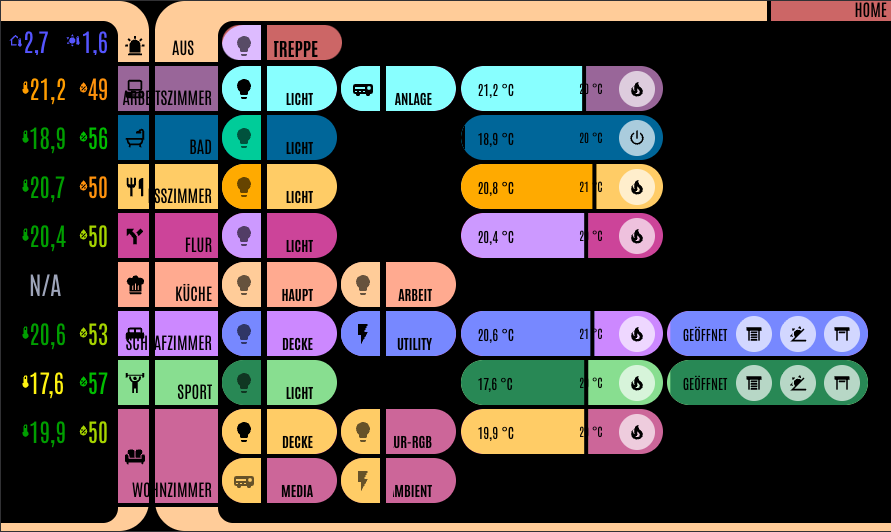
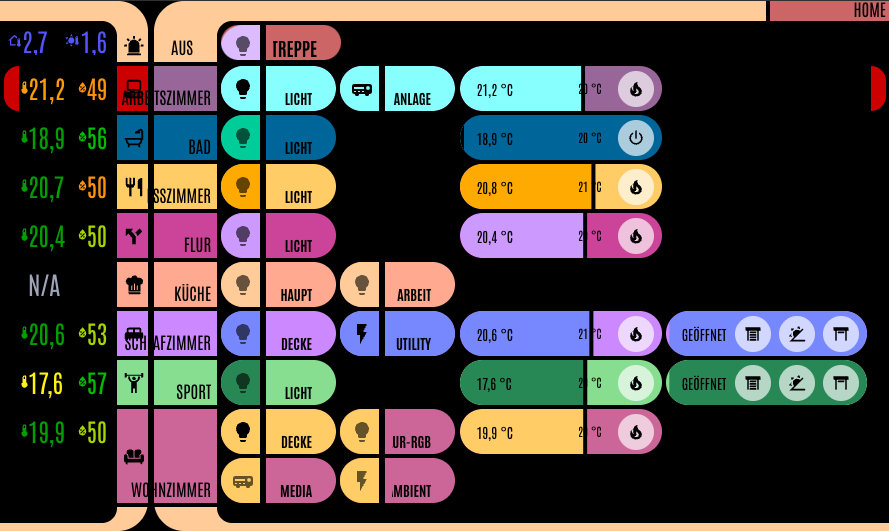
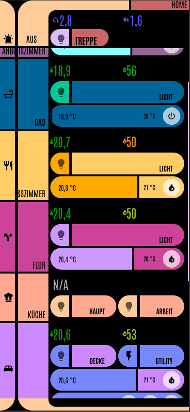
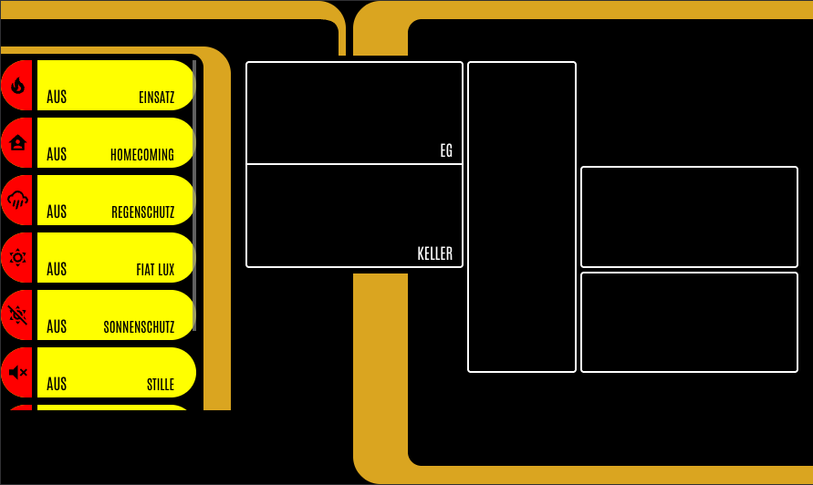
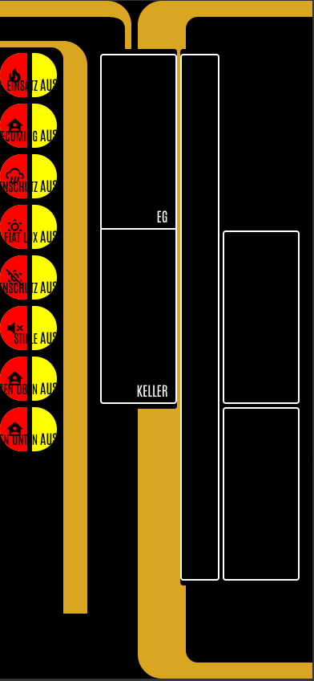
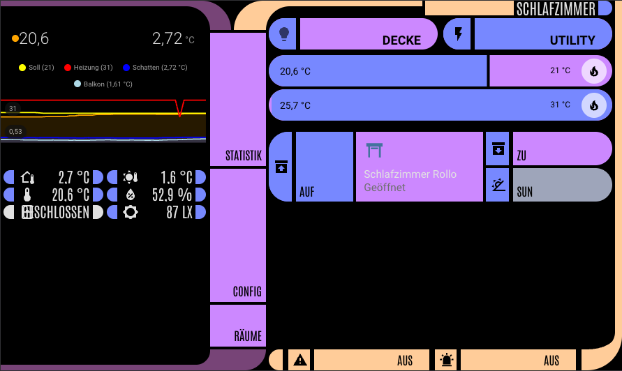
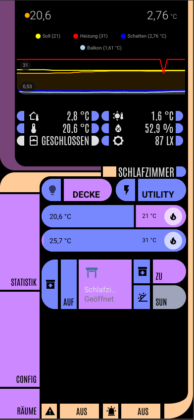
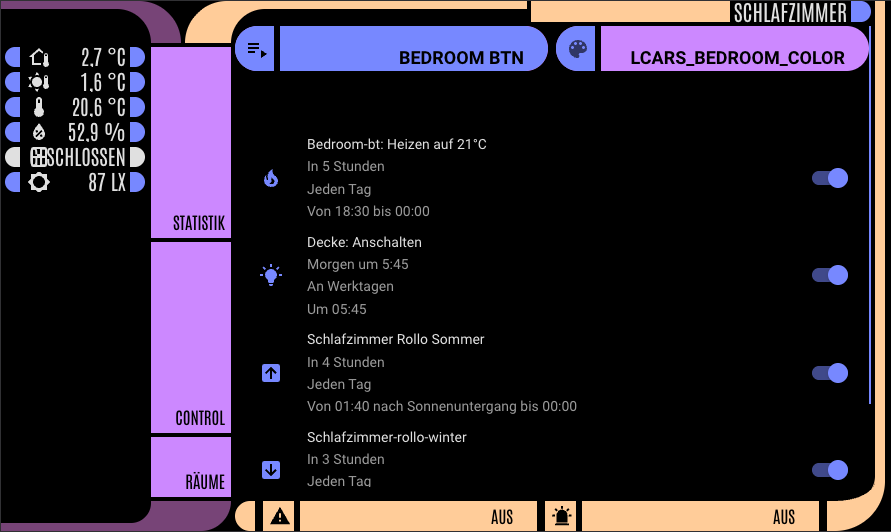
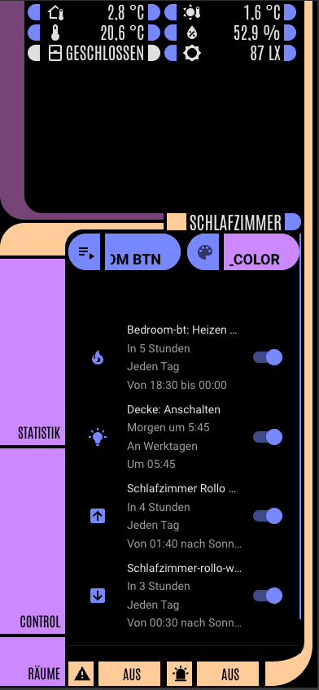

# AT LCARS

this HACS Component contains a custom dashboard strategy to mimic the iconic LCARS Design from StarTrek (mostly TNG and Voyager), without the hassl to create dashboards manualy.

## Please notice
- this is my first HACS Component
- im not a huge StarTrek Fan, so please be kind judging the implementation of LCARS
- see the Version Number its Currently in alpha State. its working on both of my homeassistant installations, but these are similar configured (see section Configuration)
- the Floor Overview is primarly optimized on a raspberry pi 7 inch screen in landscape, but it responsive
- im German so sometimes labels have German naming. will be configureabel in later versions

## Dependencies
- [Bubble-Card](https://github.com/Clooos/Bubble-Card)
    - all Buttons
    - all info Elements
    - most Cover Sliders
    - Temperature / Climate Sliders
<details>
<summary>click to show optional dependencies</summary>

- [mini-graph-card](https://github.com/kalkih/mini-graph-card)
    - room heating overview
- [Slider-Button-Card](https://github.com/custom-cards/slider-button-card)
    - vertical slider for Cover in Room view. this the only slider i found which can be set mimic the behaviour of a Cover
- [Scheduler-Card](https://github.com/nielsfaber/scheduler-card)
    - in Room Config to set schedules from dashboard
- kiosk-mode 
    - to remove the stupid header and sidebar (in the mobile app you setup a gesture to open sidebar first);
- plotly-card
    - statistiisk


</details>

## Installation
[](https://my.home-assistant.io/redirect/hacs_repository/?owner=atopetiff&repository=at_lcars&category=plugin)

## Setup
<details>
<summary>click to show dependencies</summary>

1. New Dashboard
2. Dashboard Raw Editor:

```yaml
   strategy:
     type: custom:at-lcars-strategy
```
</details>

create boolean helper with name `input_boolean.lcars_kiosk` this. toggles the kiosk mode

## Configuration

you should put your Areas in Floors with levels, and set the correct temperature and hummidity entities

### labels
since i dont like displaying all and putting a no dashboard or something like that on my entities i choose the other way around, so that i can explicit put an entity no matter what type whererever i want
Labels|Description|
|---|---|
|`outside-sun`|Sensor for outside Temperature sensor (sund). is displayed every Floor view and room Temperature Graph|
|`outside-shadow`|Sensor for outside Temperature sensor (shadow). is displayed every Floor view and room Temperature Graph|
|`RedAlert`|in my case a boolean input helper that sets alarm mode. is displayed in every floor view top middle and in room bottom right|
|`YellowAlert`|in my case a boolean input helper that sets semi alarm  mode. is displayed room bottom middle|
|`Thermostat`|climate entity for a room, is displayed in floor overview and room|
|`Heizung`|the real heating entity or entities in the room, is displayed in room only split between `Thermostat` and `Heizung` because of usage of better_thermostat|
|`Licht`|A Lamp|
|`Außenlicht`|Outside Lighting get displayed in every floor view top row|
|`PowerToggle`|a outlet or whatever|
|`Cover`||
|`Info`|information entities that should be displayed in room view left|
|`everyroom`| entities that should be displayed in room view left, and can be used in the scheduler-component|
|`Window`|A Window entity. Currently only the first in the room with that label creates the alarm border. Multiple windows in a Room --> Create an Or Group|
|`Config`|shows an Entity in room Config|
|`hidden`|hides a room from the house view|
|`Battery`|if activated in the dashboard Config all entities with this label will be shown in room overview if ther value is below the configured value
|`EveryConfig`|shows entity in every room config panel
|`Quick`|shows entity in the top of roomview

### Colors

Default is a color Scheme implementend this is than used in every Room which doesnt define it own scheme. 

this can be done by setting up en input helper in that room of type text with the label `LCARS_color` is must contain 4 valid colors seperated by `,`
like
```
#c9c,#646,#fc6,#9a6799
```

## Overview

### Floor

the starting point of the dashboard is the first floor in alphabetic order

in the top right corner is a button to navigate to the house overview

---

open windows get displayed



---

mobile:



### House

very basic this is an open todo


 

### Room

the Statisitik button is not implementent yet

#### Control view



 

---

#### Config



 